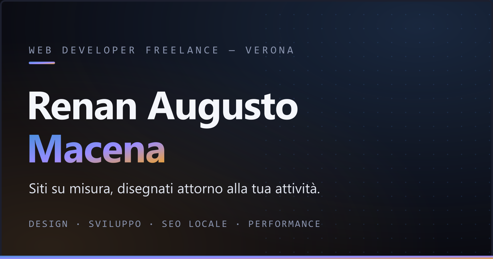

# Renan Augusto Macena — Portfolio

Portfolio da web developer freelance: siti su misura per le attività locali del veronese, disegnati e costruiti a mano.

**Live:** https://renanaugustomacena-ux.github.io/freelance-portfolio/



## Cosa contiene

- **Landing** — hero con shader WebGL dithered, marquee editoriale, statistiche reali, processo di lavoro in 4 passi, FAQ con schema FAQPage
- **Clienti** — clienti reali online, con caso studio dedicato (MasterTetto)
- **Templates** — demo di design per attività locali di Mozzecane, fino a 3 proposte ciascuna
- **Progetti** — progetti personali e repository GitHub (fetch a build-time)

## Stack & scelte tecniche

- [Astro 4](https://astro.build) statico, vanilla CSS con design token, zero framework runtime
- Font variabili **self-hosted** (`@fontsource-variable`) — nessuna CDN esterna, GDPR-friendly
- **View Transitions** cross-document, animazioni scroll-driven CSS, tilt 3D e cursore custom (tutto gated da `prefers-reduced-motion`)
- SEO: JSON-LD (Person, ProfessionalService, FAQPage, BreadcrumbList), og-image generata da SVG, sitemap, robots.txt
- Accessibilità: WCAG AA (contrasti verificati), skip-link, focus visibile, menu con `aria-expanded`
- Budget: ~40 KB CSS, ~5 KB JS per pagina

## Sviluppo

```bash
npm ci          # installa le dipendenze
npm run dev     # server di sviluppo
npm run build   # build di produzione in dist/
npm run preview # anteprima della build
```

La og-image si rigenera con `node tools/gen-og.mjs` (sharp).

## Deploy

Push su `main` → GitHub Actions builda e pubblica su GitHub Pages (`.github/workflows/deploy.yml`).

---

© Renan Augusto Macena · Mozzecane, Verona
